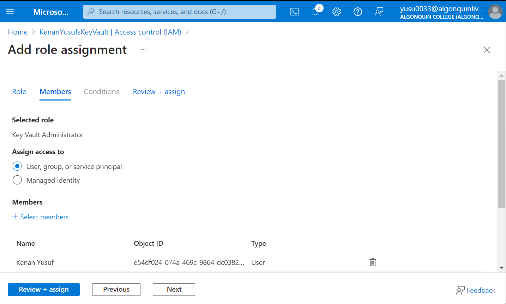
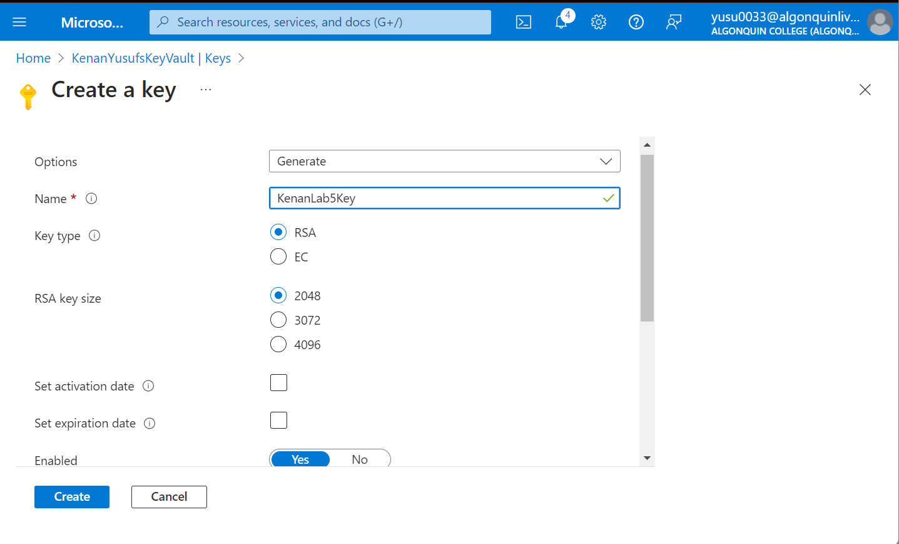
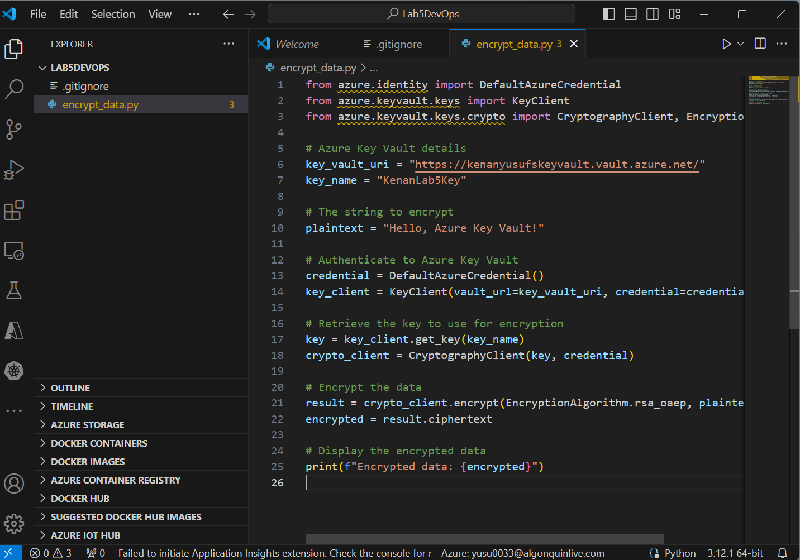
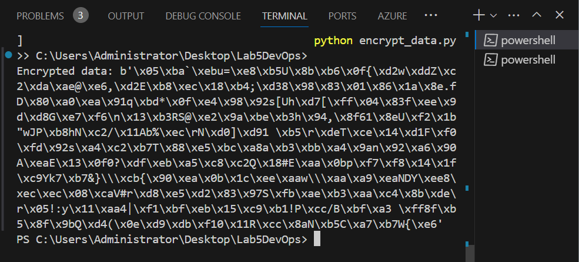
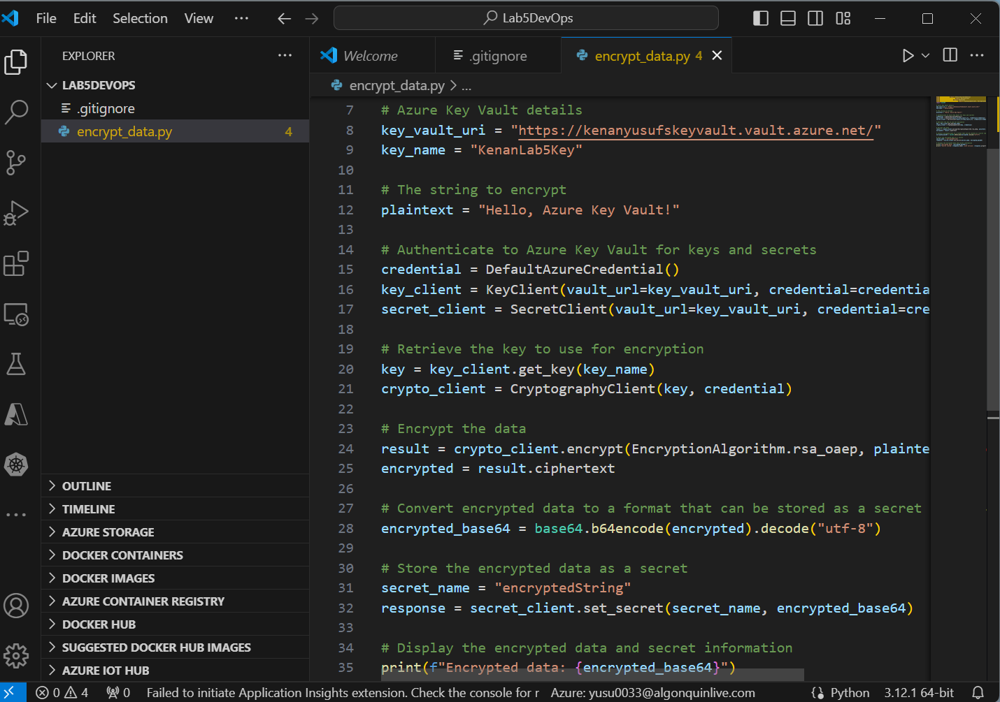
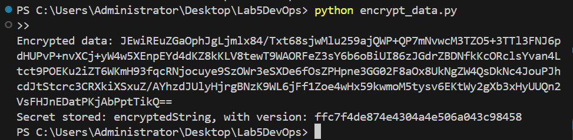
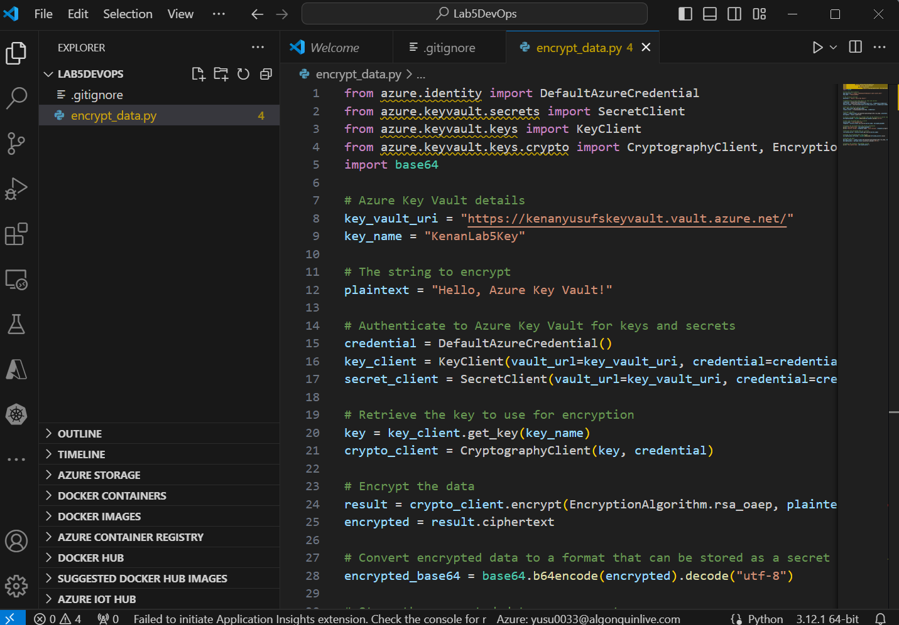
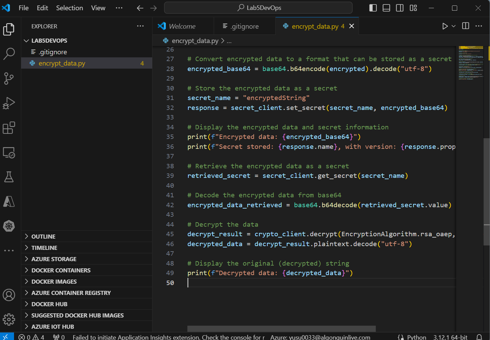
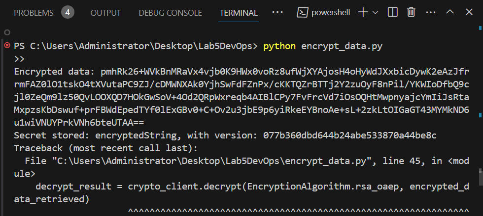
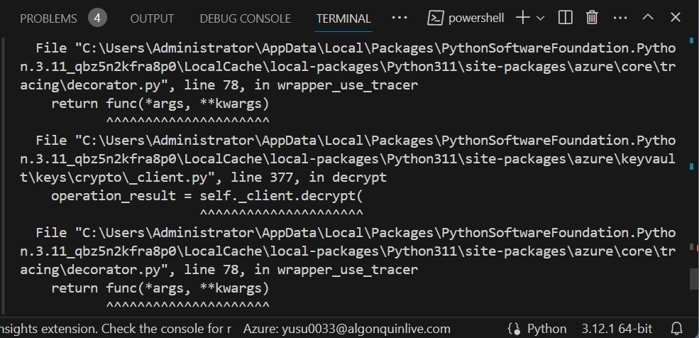

# Encryption and Key Management with Azure Key Vault

## Setup of Azure Key Vault

### Creating the Key Vault

- **Navigation**: Accessed Azure Portal and navigated to "Create a resource" > "Key Vault".
- **Configuration**: Specified a unique name, selected a subscription, resource group, and region.
- **Review and Creation**: Reviewed the settings and created the Key Vault.

### Setting Access Policies

- **Access Control**: Configured access policies to allow my account to manage keys and secrets.
- **Permissions**: Granted permissions for key and secret management, ensuring the application could encrypt, decrypt, store, and retrieve data.

### Creating an Encryption Key

- **Key Generation**: Used Azure Key Vault to generate a new RSA key named `KenanLab5Key`.
- **Key Management**: Noted down the key identifier for use in the encryption and decryption process.

## Encryption, Storage, Retrieval, and Decryption Processes

### Encrypting Data

- **Script Setup**: Installed necessary Azure SDK packages using `pip`.
- **Data Encryption**: Wrote a Python script that takes a plaintext string, encrypts it using the Azure Key Vault key, and displays the ciphertext.

### Storing Encrypted Data

- **Secret Storage**: Modified the script to store the encrypted string as a secret in Azure Key Vault.

- **Confirmation**: Script outputs confirmation that the secret is stored, along with its identifier.

### Decrypting Data

- **Key and Secret Retrieval**: Script fetches the encryption key and the encrypted string (stored as a secret) from Azure Key Vault.

- **Data Decryption**: Uses the fetched key to decrypt the string, displaying the original message to confirm successful decryption.

## Challenges and Resolutions

- **Authentication Issues**: Encountered difficulties with the `DefaultAzureCredential` method, resolved by using the Azure CLI to log in with `az login`.
- **Permission Errors**: Initially received a `Forbidden` error when attempting to decrypt data. Resolved by adjusting the access policies in Azure Key Vault to include decrypt permissions for the application.
